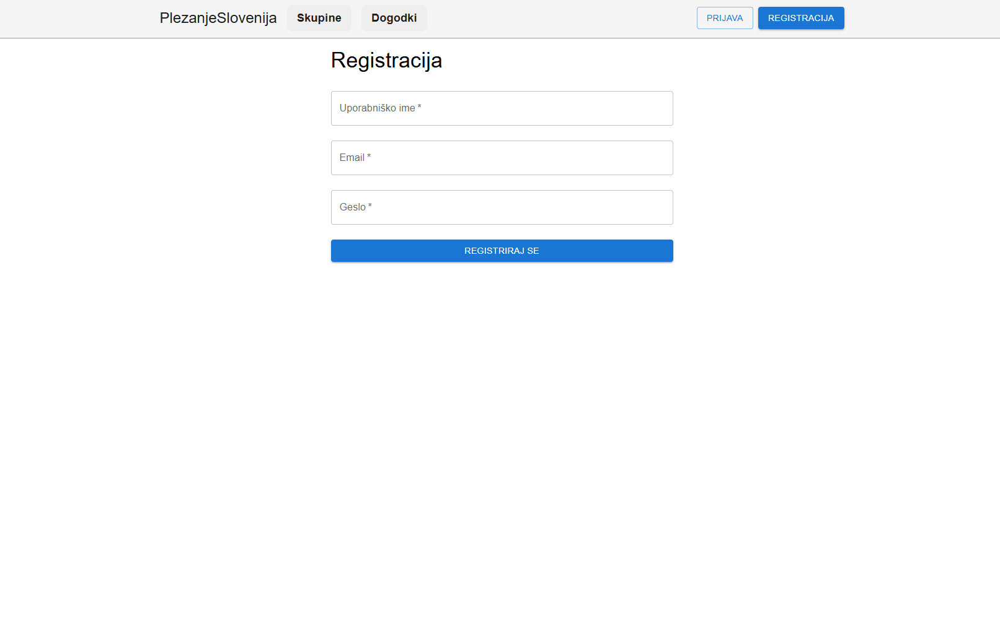

# Navodila za namestitev in uporabo sistema
## Namestitev rešitve (lokalno)
### Kloniranje repozitorija
Odprite terminalno okno v glavni mapi programa. Nato izvedite naslednje ukaze:
```bash
git clone https://github.com/RockSolidProject/WebApp.git
cd WebApp
```
### Namestitev odvisnosti
Namestitev obveznosti na zalednem in čelnem delu aplikacije.
```bash
cd frontend
npm install
cd ../backend
npm install
```
### Nastavitve okolja
Za pravilno delovanje aplikacije je potrebno v korenski mapi čelnega (`frontend`) in zalednega (`backend`) dela ustvariti datoteko **.env**.

V datoteko **.env** v zalednem delu dodajte naslednje nastavitve:
```
JWT_SECRET_KEY=some_secret_key
MONGODB_LINK=mongodb://localhost:27017/rocksolid
```
V čelnem delu pa:
```
VITE_BACKEND_URL=http://localhost:3001
```
Po potrebi prilagodite te vrednosti glede na vaše okolje.

## Zagon aplikacije
Odprite terminalno okno v glavni mapi programa. In za zagon aplikacije izvedite naslednje ukaze:
```bash
cd backend
npm run dev
```
Za zagon zalednega dela.
In naslednje ukaze za zagon čelnega dela.
```bash
cd frontend
npm run dev
```
## Registracija in prijava v sistem
1. Odprite aplikacijo v brskalniku na naslovu `http://localhost:5173`.
2. Kliknite na gumb **Registracija** v navigacijski vrstici in izpolnite zahtevana polja (uporabniško ime, e\-pošta, geslo).


3. Po uspešni registraciji se lahko prijavite z vašimi podatki.


4. Po prijavi lahko uporabljate vse funkcionalnosti sistema.