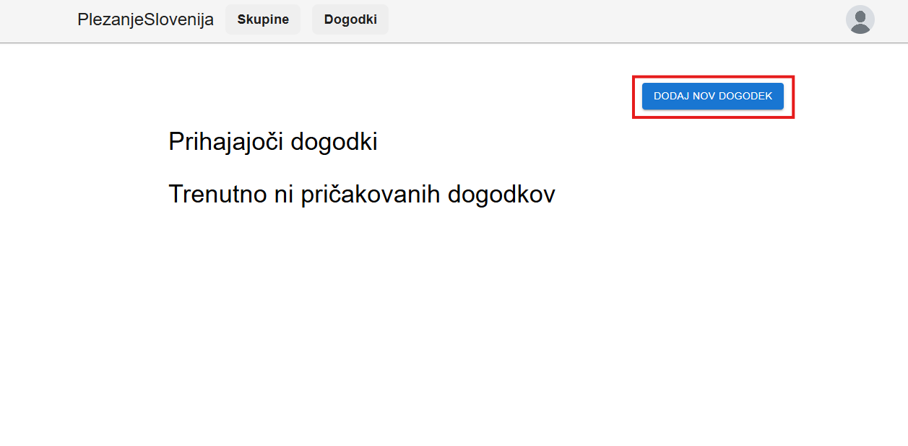

## Primeri uporabe

### 1. Iskanje plezališča v bližini

**Kaj uporabnik želi narediti:**  
Izkušeni plezalec ali plezalec začetnik želi najti primerno plezališče v svoji bližini.

**Koraki izvedbe:**
1. Odpri domačo stran.
2. Izberi točko na zemljevidu.
3. Z drsnikom nastavi željeno razdaljo.

4. Izberi minimalno število smeri, ki jih plezališče naj ima.

**Rezultat:**  
Uporabnik na zemljevidu vidu plezališča v okolici, pod njim pa je tudi seznam teh plezališč.

---

### 2. Označevanje preplezane poti

**Kaj uporabnik želi narediti:**  
Uporabnik želi označiti, da je neko plezalno smer uspešno preplezal.

**Koraki izvedbe:**
1. Poišči plezališče na zemljevidom, na seznamu ali z iskalnikom.
2. Klikni na plezališče.
3. Poišči preplezano smer.
4. Označi kot "Preplezano".

5. Vpiši število poizkusov in dodeli težavnost.
6. Klikni na gumb "POTRDI".

**Rezultat:**  
Ocena uporabnika se prikaže na grafu, in vpliva na povprečno težavnost smeri.

---

### 3. Dodajanje novega plezališča

**Kaj uporabnik želi narediti:**  
Izkušeni plezalec želi dodati novo notranje plezališče, ki ga še ni v sistemu.

**Koraki izvedbe:**
1. V levem meniju izberi možnost "Dodaj center".

2. Vnesi ime, lastnosti, GPS koordinate (izbira s klikom na zemljevid).
3. Dodaj slike in informacije o dostopu.
4. Shrani plezališče.

**Rezultat:**  
Novo plezališče se pojavi na zemljevidu. Drugi uporabniki lahko komentirajo in ocenjujejo.

---

### 4. Ustvarjanje dogodka za skupino

**Kaj uporabnik želi narediti:**  
Organizator želi povabiti člane skupine na skupno plezanje.

**Koraki izvedbe:**
1. Pojdi v sekcijo "Dogodki" v navigacijski vrstici in klikni "Ustvari dogodek".

2. Nastavi ime dogodka, datum, opis, skupino, sliko, ter v katerem centru oziroma plezališču se bo dogodek dogajal.

4. Potrdi dogodek s klikom na gumb "ustvari dogodek".

**Rezultat:**  
Dogodek se prikaže uporabnikom, ki so člani skupine.

---

### 5. Komentiranje plezalne poti

**Kaj uporabnik želi narediti:**  
Plezalec želi dodati komentar na plezalni center.

**Koraki izvedbe:**
1. Poišči plezalni center.
2. Napiši komentar in po želji dodaj sliko.
3. Objavi komentar z pritiskom na gumb "Dodaj komentar"

**Rezultat:**  
Komentar je viden pod centrom, skupaj z imenom uporabnika in časom objave.

