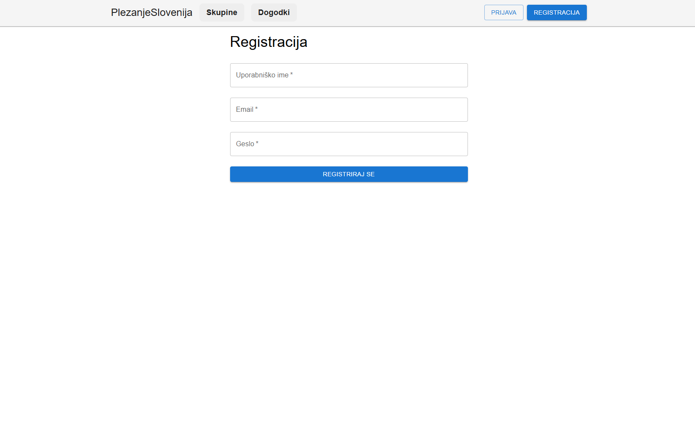
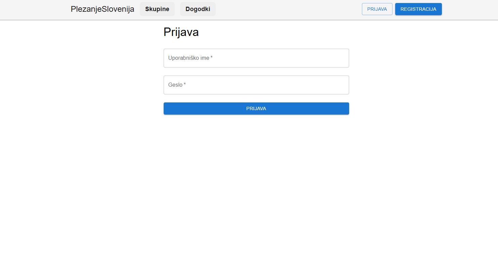

# Dokumentacija študentskega projekta: RockSolid

## 1. Projektne specifikacije

### 1.1 Namen projekta

Cilj projekta **RockSolid** je razviti spletno aplikacijo, ki plezalcem omogoča enostavno iskanje **plezalnih centrov** in **zunanjih plezališč** glede na geografsko lokacijo ter ponuja podporo za **dodajanje novih lokacij**, **plezalnih poti**, **skupin** in **dogodkov**.

#### Skupine uporabnikov:
- **Plezalci začetniki**: iščejo primerna mesta za plezanje v bližini.
- **Izkušeni plezalci**: delijo lastna odkritja in dodajajo plezalne poti in plezališča.
- **Organizatorji skupin/dogodkov**: upravljajo skupine in organizirajo srečanja.

### 1.2 Opis rešitve

Projekt je razvit z uporabo **MERN sklada** (MongoDB, Express.js, React, Node.js). Uporabnikom omogoča:
- iskanje plezalnih lokacij glede na izbrano območje,
- dodajanje in urejanje podatkov o plezališčih in plezalnih poteh,
- ustvarjanje plezalnih skupin in dogodkov,
- sodelovanje in povezovanje z drugimi uporabniki,
- vključevanje v skupine in prijavo na dogodke.

S tem projekt naslavlja potrebe po boljši preglednosti plezališč in večji povezanosti plezalcev.

---

### 1.3 Ključne funkcionalnosti

- **Iskanje plezališč**
    - Po območju označenem na zemljevidu ali pa v območju okoli koordinate.
    - Filtriranje po tipu lokacije (center / zunanje plezališče).
    - Filtriranje po določenih lastnostih (število poti, ali ima kilter steno ...).

- **Dodajanje in urejanje plezališč**
    - Opis, GPS koordinata
    - Uporabniško dodajanje in moderacija

- **Upravljanje skupin in dogodkov**
    - Ustvarjanje skupin, dodajanje članov
    - Organizacija dogodkov (lokacija, čas, opis)
    - Možnost prijave/odjave na dogodke

- **Uporabniški račun**
    - Registracija/prijava
    - Uporaba JWT za avtentikacijo
    - Urejanje profila, prikaz podrobnosti profila

- **Komentiranje**
    -  Dodajanje komentarjev na plezalne centre in plezalne poti.
    -  Prikaz komentarjev z uporabniškim imenom in časom objave.

- **Označevanje poti kot preplezane**
    - Uporabnik lahko označi posamezno plezalno pot kot preplezano.
    - Ob označitvi vnese število poizkusov, ki jih je potreboval za uspešno preplezanje.
    - Prikaz preplezanih poti v uporabniškem profilu.
    - Možnost izbire težavnosi (prikaže se povprečna ocena).

---
## 2 Zahteve
### Sistemske zahteve
- [Node.js](https://nodejs.org/) (priporočena različica 18+)
- [MongoDB](https://www.mongodb.com/) (lokalno nameščen ali MongoDB Atlas)
- Git

### Strojne zahteve
Za lokalno delovanje ali postavitev na lastni strežnik priporočamo naslednje minimalne specifikacije:

#### Minimalne zahteve (lokalni razvoj ali testni strežnik):
- **CPU**: 1 jedri
- **RAM**: 2 GB
- **Disk**: 2-3 GB prostega prostora

#### Priporočene zahteve):
- **CPU**: 2 jedra ali več
- **RAM**: 4 GB ali več
- **Disk**: 5 GB

## 3 Glavne knjižnjice in orodja
Projekt **RockSolid** je razvit z uporabo **MERN** sklada z dodatnimi orodji in knjižnicami za izboljšano uporabniško izkušnjo,podporo za zemljevid in varnost.
### Čelni del (React + Vite)
- **React 18** s podprto **React Router v7** za navigacijo
- **Vite** - hitro razvojno okolje za čelni del
- **Material UI** za oblikovanje komponent
- **Leaflet** in **React Leaflet Cluster** za prikaz plezališč na zemljevidu in grupiranje markerjev.
- **Dompurify** za varno prikazovanje HTML vsebine
- **JWT Decode** za pridobivanje podatkov iz žetonov
- **Recharts** za prikaz statistik in grafov

### Zaledni del (Node.js + Express)
- **Express.js** za definiranje API poti
- **MongoDB + Mongoose** kot baza in ORM
- **JWT** za avtentikacijo uporabnikov
- **Bcrypt.js** za varno shranjevanje gesel
- **Multer** za nalaganje slik
- **Haversine-distance** in **point-in-polygon** za geolokacijske izračune
- **Jest + Supertest** za testiranje zalednega dela aplikacije 

### Orodja za razvoj
- **Vite** (frontend) in **Nodemon** (backend)
- **ESLint** za analizo kode in vzdrževanje standardov
- **Jest** za testiranje backend funkcionalnosti
- **dotenv** za konfiguracijo okolja

---

## 2. Navodila za namestitev in uporabo sistema
### 2.1 Namestitev rešitve (lokalno)
#### Kloniranje repozitorija
Odprite terminalno okno v glavni mapi programa. Nato izvedite naslednje ukaze:
```bash
git clone https://github.com/RockSolidProject/WebApp.git
cd WebApp
```
#### Namestitev odvisnosti
Namestitev obveznosti na zalednem in čelnem delu aplikacije.
```bash
cd frontend
npm install
cd ../backend
npm install
```
#### Nastavitve okolja
Za pravilno delovanje aplikacije je potrebno v korenski mapi čelnega (`frontend`) in zalednega (`backend`) dela ustvariti datoteko **.env**.

V datoteko **.env** v zalednem delu dodajte naslednje nastavitve:
```
JWT_SECRET_KEY=some_secret_key
MONGODB_LINK=mongodb://localhost:27017/rocksolid
```
V čelnem delu pa:
```
VITE_BACKEND_URL=http://localhost:3001
```
Po potrebi prilagodite te vrednosti glede na vaše okolje.

### 2.2 Zagon aplikacije
Odprite terminalno okno v glavni mapi programa. In za zagon aplikacije izvedite naslednje ukaze:
```bash
cd backend
npm run dev
```
Za zagon zalednega dela.
In naslednje ukaze za zagon čelnega dela.
```bash
cd frontend
npm run dev
```
### 2.3 Registracija in prijava v sistem
1. Odprite aplikacijo v brskalniku na naslovu `http://localhost:5173`.
2. Kliknite na gumb **Registracija** v navigacijski vrstici in izpolnite zahtevana polja (uporabniško ime, e\-pošta, geslo).


3. Po uspešni registraciji se lahko prijavite z vašimi podatki.

  
4. Po prijavi lahko uporabljate vse funkcionalnosti sistema.


## 3. Ključni primeri uporbe


